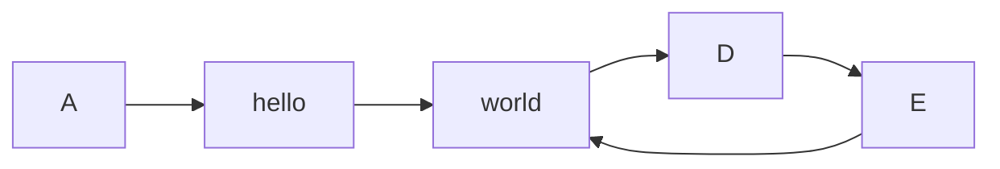
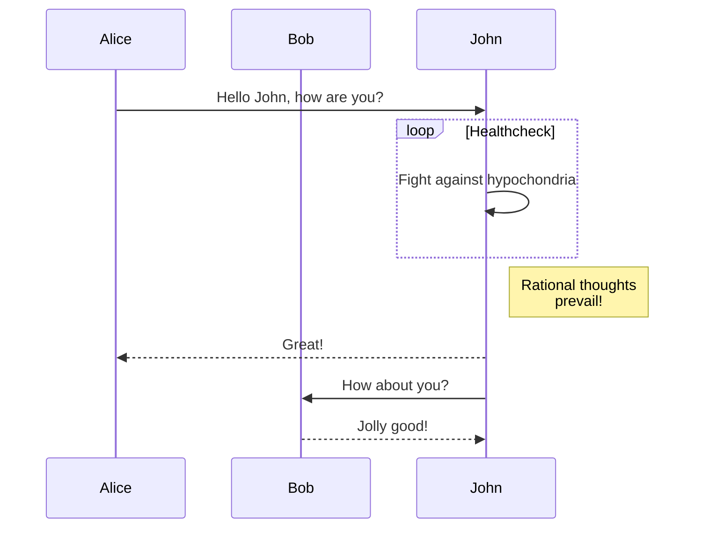
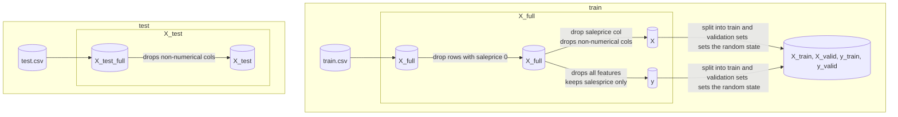
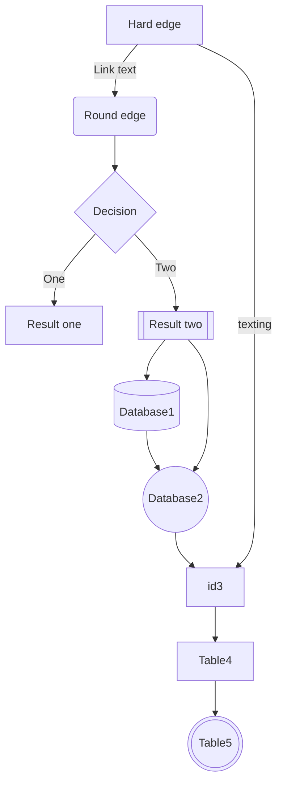
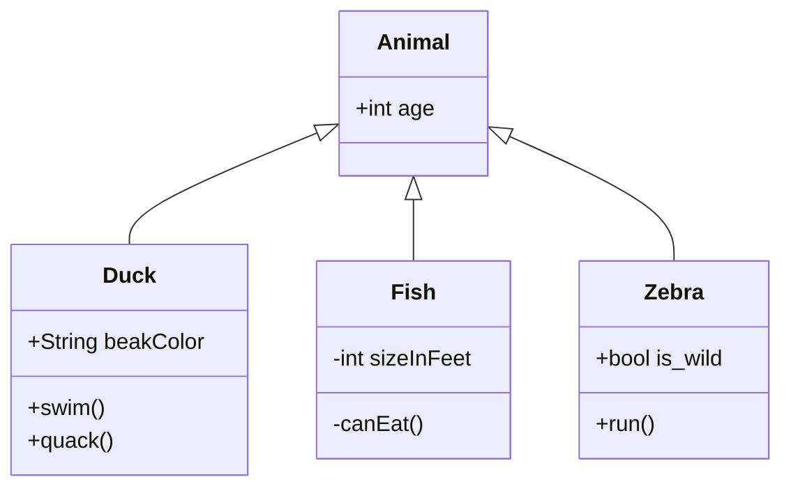
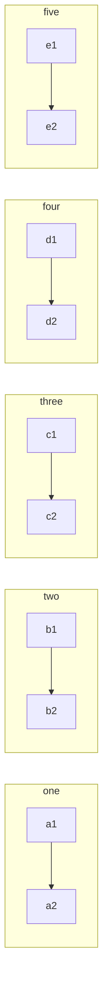

# graps

```mermaid
graph LR
A --> B[hello]
B --> C[world]
C --> D
D --> E
E --> C
```

# sequence

```mermaid
sequenceDiagram
    participant Alice
    participant Bob
    Alice->>John: Hello John, how are you?
    loop Healthcheck
        John->>John: Fight against hypochondria
    end
    Note right of John: Rational thoughts <br/>prevail!
    John-->>Alice: Great!
    John->>Bob: How about you?
    Bob-->>John: Jolly good!
```

# flowchart

```mermaid
graph TD

    id1[(train.csv)] & id2[(test.csv)]
    subgraph train
    id1 --> id3[(X_full)]
        subgraph X_full
        id3 -- drop rows with saleprice 0 --> id3_1[(X_full)]
        id3_1 -- drops all features </br> keeps salesprice only --> id5[(y)]
        id3_1 -- drop saleprice col </br> drops non-numerical cols --> id7[(X)]
        end
    id7 & id5 -- split into train and validation sets </br> sets the random state
    --> id8[(X_train, X_valid, y_train, y_valid)]
    end
    subgraph test
    id2 --> id4[(X_test_full)]
        subgraph X_test
        id4 -- drops non-numerical cols --> id6[(X_test)]
        end
    end
```

# flowchart

```mermaid
graph TD
    A[Hard edge] -->|Link text| B(Round edge)
    B --> C{Decision}
    C -->|One| D[Result one]
    C -->|Two| E[[Result two]]
    id1[(Database1)] --> id2((Database2))
    E -->   id2((Database2)) & id1
    id2 --> id3
    id3 --> id4[Table4]
    id4 --> id5(((Table5)))
    A-- texting --> id3

```

# data

```mermaid
classDiagram
    Animal <|-- Duck
    Animal <|-- Fish
    Animal <|-- Zebra
    Animal : +int age
    Animal

    class Duck{
        +String beakColor
        +swim()
        +quack()
    }

    class Fish{
        -int sizeInFeet
        -canEat()
    }

    class Zebra{
        +bool is_wild
        +run()
    }
```

# subgraph

```mermaid
graph LR
    subgraph one
    a1-->a2
    end
    subgraph two
    b1-->b2
    end
    subgraph three
    c1-->c2
    end
    subgraph four
    d1-->d2
    end
    subgraph five
    e1-->e2
    end
```
