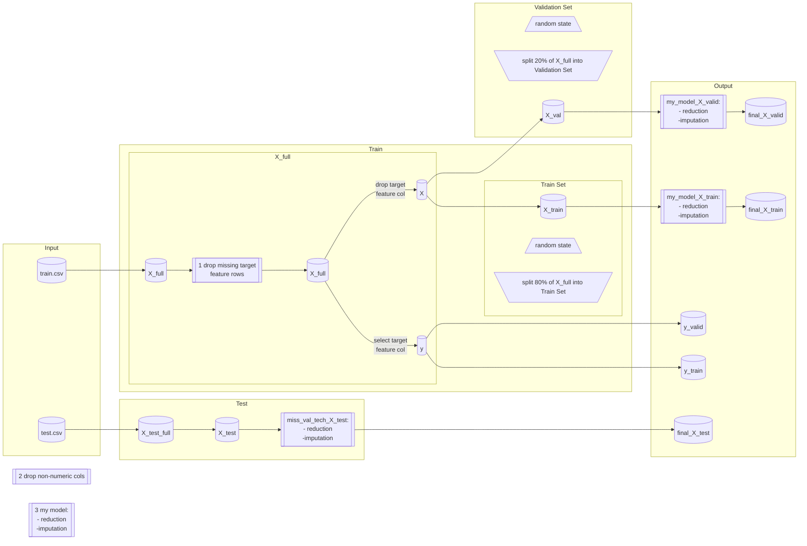
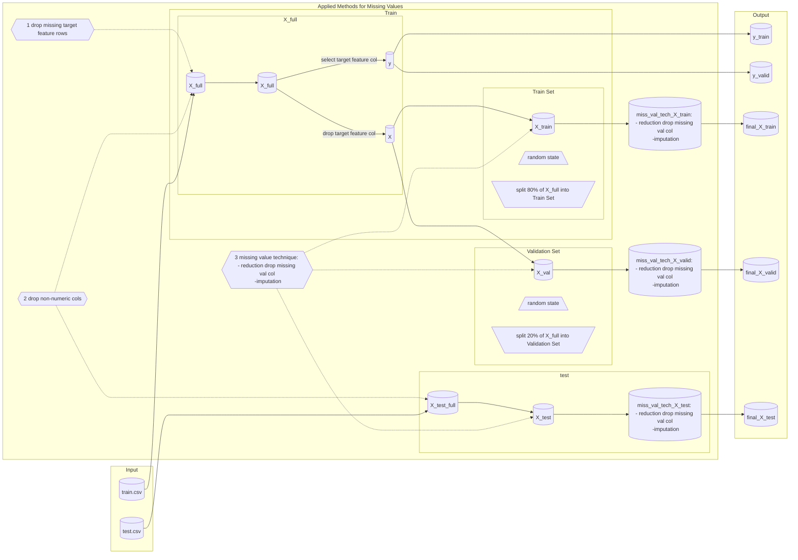
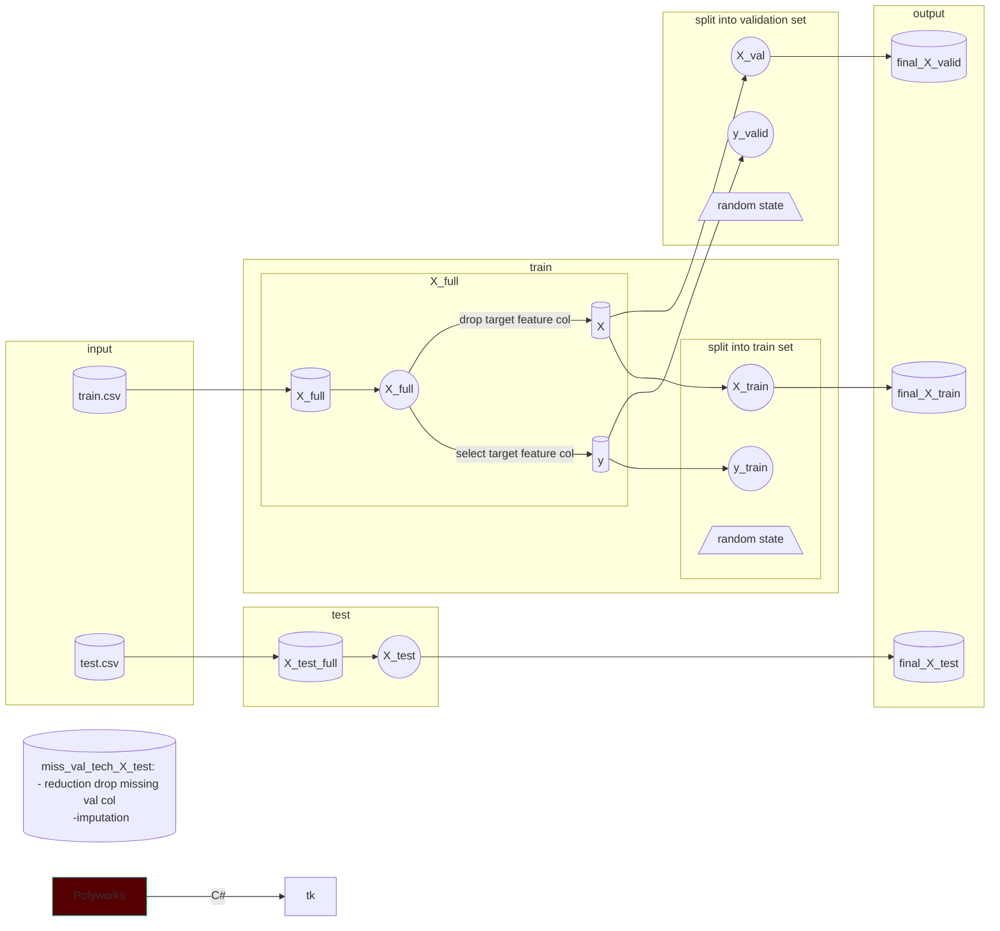

## Data modifications:

1. start with two datasets: train and test
1. Drop rows with missing`SalesPrice` from train
1. Make `SalesPrice` column = target = y (for train)(train set target)
1. Remove `SalesPrice` columns from the original dataset (for train)
1. Drop all columns with non-numeric data or strings (for train)(train set features, X)
1. Drop all columns with non-numeric data or strings (for test)
1. Break off validation set from training data (for train)
1. Impute missing values with the mean value along each column (for train)

1-------------

# flowchart

2-------------

# flowchart

3-------------

# flowchart

# Notes:

Make sure that you use a method that agrees with how you preprocessed the training and validation data, and set the preprocessed test features to final_test_features `final_X_test`.
